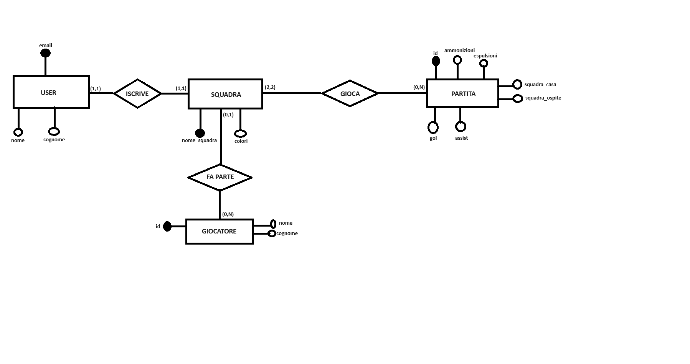
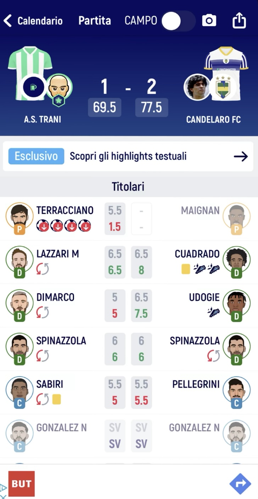
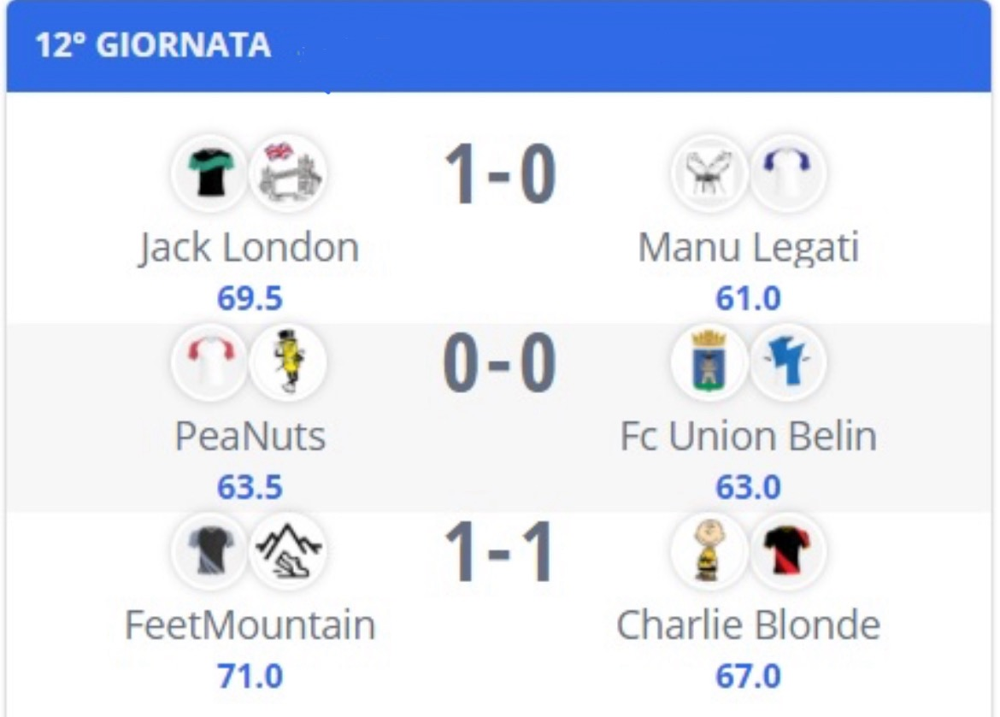
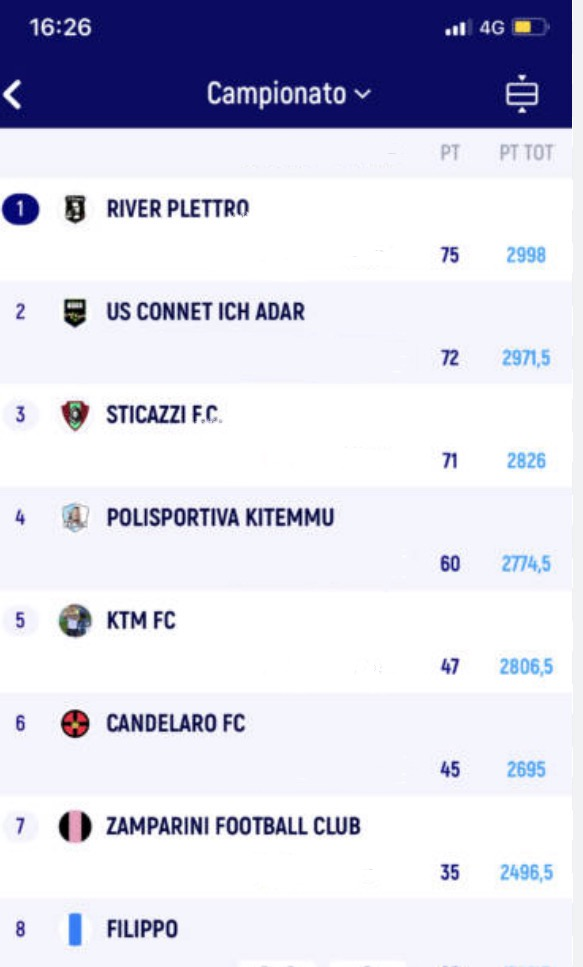

# FantaLabo
# DESCRIZIONE 
Facilitare il calcolo dei voti dei calciatori con i vari bonus (gol, assist) e malus (ammonizioni, espulsioni) per sommarli e scoprire la squadra vincente. Sucessivamente calcolare la calssifica totale e conoscere il vincitore del campionato.  (ispirato a fantamaster).
# Problema:  
Aiutare gli appasionati di calcio che vogliono creare un campionato di fantacalcio tra amici per divertirsi, secondo i voti dei giocatori reali.
# Elenco funzionlità:  
-registra un campionato (personalizzazione nome e budget per squadra)  
-registra una squadra (personalizzazione nome e colori sociali)  
-mercato (inserimento giocatori nelle squadre)  
-voto giocatore  
-punteggio totale di squadra  
-calendario partite  
-classifica (3pt vittoria; 1pt pareggio; 0pt sconfitta)  
-classifica statistiche giocatori (gol, assist, g/a, ammonizioni, espulsioni)
# TARGET
appasionati di calcio
# SCHEMA E/R

# SCHEMA RELAZIONALE
USER(<ins>Email<\ins>, nome, cognome)
SQUADRA(<ins>nome_squadra<\ins>, colori)
GIOCATORE(<ins>id<\ins>, nome, cognome, <ins>SQUADRA _id<\ins>)
GIOCA(<ins>GIOCATORE_id<\ins>, <ins>SQUADRA_id<\ins>)
PARTITA(<ins>id<\ins>, squadra_casa, squadra_ospite, gol, assist, ammonizioni, espulsioni)

# MOKUP
schermata principale

Schermata inserimento giocatori

Schermata partita

schermata risultati

schermata classifica

